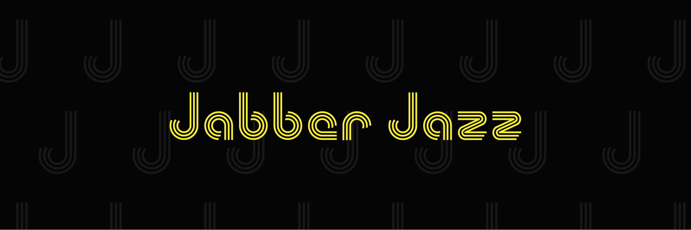

# Jabber Jazz Content Notes

A website for the podcast notes and other reference content for the [Jabber Jazz Podcast](https://linktr.ee/jabberjazz). 

## Description

Website built via [Quarto](https://quarto.org/) and hosted on GitHub. [Visit the website](https://adambushman.github.io/jabber-jazz-content-notes/)
for yourself to see the rendered content from R code and markdown that supplemented the podcast.
